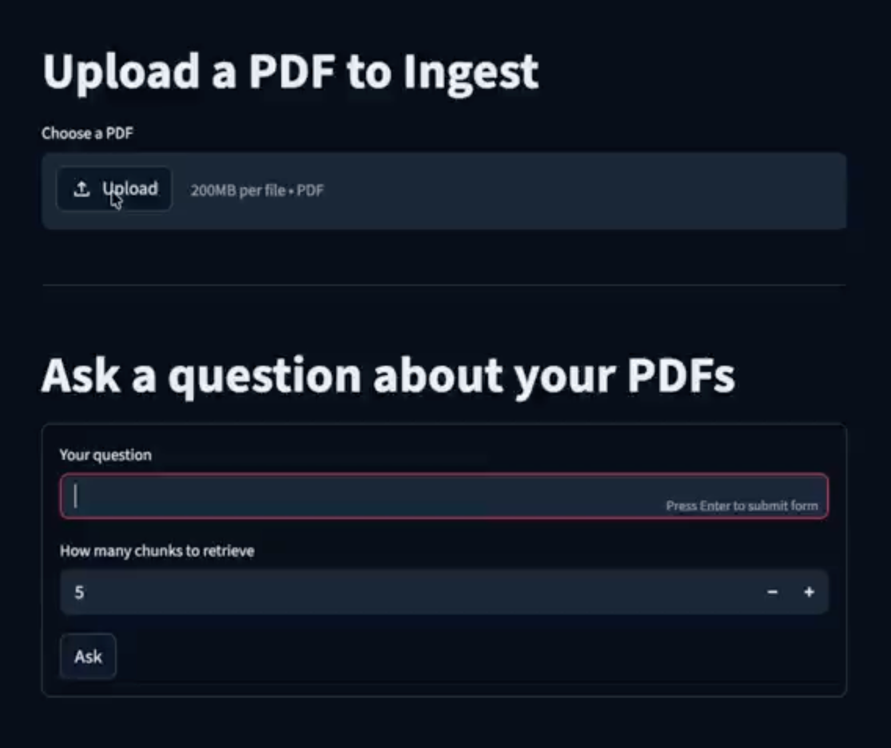

# 🚀 ChatPDF – RAG-Based Document Q&A System

ChatPDF is a **Retrieval-Augmented Generation (RAG)** application that lets users upload PDF documents and ask intelligent, context-aware questions based on their content.

It combines **semantic search + LLMs** to provide accurate answers grounded in your documents — not hallucinated responses.

---

## 🧠 How It Works

```text
Upload PDF → Extract Text → Chunk → Embed → Store in Qdrant  
User Query → Embed → Search → Retrieve Context → LLM → Answer
```

---

## 🏗️ Architecture Overview

* **Document Ingestion Pipeline**

  * PDF upload
  * OCR (for scanned docs)
  * Text extraction & chunking
  * Embedding generation
  * Storage in vector DB (Qdrant)

* **Query Pipeline**

  * User query embedding
  * Semantic similarity search
  * Context retrieval
  * LLM response generation

---

## ⚙️ Tech Stack

| Layer       | Technology            |
| ----------- | --------------------- |
| Backend     | FastAPI               |
| Frontend    | Streamlit             |
| Workflows   | Inngest               |
| Vector DB   | Qdrant                |
| Embeddings  | Sentence Transformers |
| LLM         | OpenRouter API        |
| PDF Parsing | LlamaIndex, PyPDF     |
| OCR         | Tesseract             |

---

## ✨ Features

* 📄 Upload and process PDF documents
* 🔍 Semantic search using embeddings
* 🤖 Context-aware AI responses (RAG)
* 🧾 OCR support for scanned PDFs
* ⚡ Async event-driven processing (Inngest)
* 🧠 Reduced hallucination via grounded context

---

## 📦 Installation

### 1. Clone the repo

```bash
git clone https://github.com/your-username/chatpdf.git
cd chatpdf
```

### 2. Create virtual environment

```bash
python -m venv venv
source venv/bin/activate   # Mac/Linux
venv\Scripts\activate      # Windows
```

### 3. Install dependencies

```bash
pip install -r requirements.txt
```

---

## 🔑 Environment Variables

Create a `.env` file:

```env
OPEN_ROUTER_API_KEY=your_api_key
QDRANT_URL=your_qdrant_url
```

---

## ▶️ Running the App

### Start Backend (FastAPI) (terminal 1)

```bash
uv run uvicorn main:app --reload
```

### Start Backend (FastAPI) (terminal 1)

```bash
npx inngest-cli@latest dev -u http://127.0.0.1:8000/api/inngest --no-discovery
```

### Start Qdrant (on Docker)

```bash
docker run -d -p 6333:6333 -v "(pwd)/qdrant_storage:/qdrant/storage qdrant/qdrant:latest
```

### Start Frontend (Streamlit)

```bash
uv run streamlit run streamlit_app.py
```

---

## 🧪 Usage

1. Upload a PDF via the UI
2. Wait for processing (embedding + indexing)
3. Ask questions like:

   * “Summarize this document”
   * “What are the key findings?”
   * “Explain section 3”

---

## 📸 Demo (Optional)


---

## 🤝 Contributing

Contributions are welcome!
Feel free to open issues or submit pull requests.

---

## ⭐ Support

If you like this project, consider giving it a ⭐ on GitHub!
